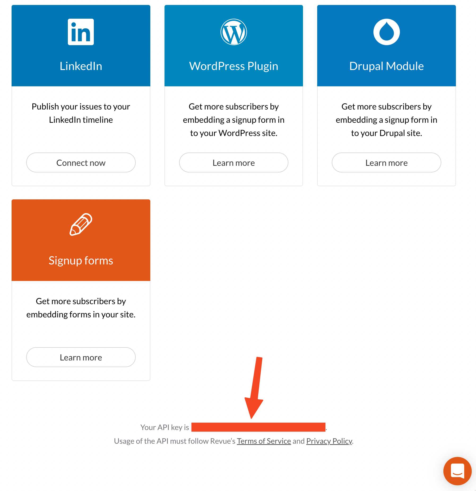

# Revue_to_md
Export your [Revue](https://www.getrevue.co/) issues to Markdown files.

- ✅Save the result as `data.json`
- ✅Export all issues in Markdown format
- ✅Auto download all images

[简体中文请点这里](README_cn.md)

## ⚠️Prerequirements

**Revue API TOKEN** is needed for this project to run.

<!-- You can find your API token at the bottom of: [getrevue.co/app/integrations](https://www.getrevue.co/app/integrations). -->



## Installation

1. Install 

```
git clone git@github.com:justinyanme/Revue_to_md.git
cd Revue_to_md
npm install
```

2. Copy and Edit `config.json`

```
cp config.sample.json config.json
vi config.json
```

replace `<your-revue-api-token>` with your token.

```json
{
    "log": {
        "level": "info",
        "hostname": "R2MD"
    },
    "revue": {
        "token": "<your-revue-api-token>"
    }
}
```

## Usage

Build before run.

```
npm run build
```

You're all set! Just run the command: `node built/index.js`

```
node built/index.js

index <cmd> [args]

Commands:
  index listIssues  List all issues from revue
  index saveInMD    Save all issues in markdown format

Options:
  --version  Show version number                                       [boolean]
  --help     Show help                                                 [boolean]
```

If you wanna download all images the issues included, just run with `-i`:

```
node built/index.js saveInMD -i
```

All files are stored at the `out` directory in the project root path.